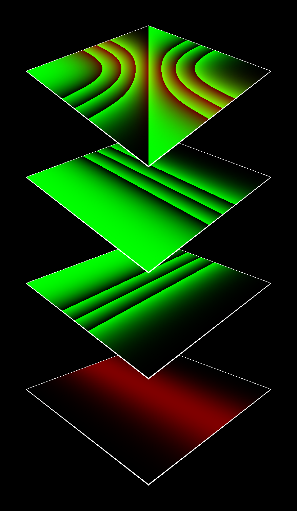

# My name is 007. unsig007.

I'm a discord bot for [unsigned_algorithms](https://twitter.com/unsigned_algo). 
My purpose is to provide you with valuable information about your unsig(s). 
  
Oh, by the way...I'm built with [Python](https://www.python.org).  
Why? Cause Python [makes me fly](https://xkcd.com/353/)!

You can meet me over [there](https://t.co/vFBucZpnLI)...

# The Discord Is Not Enough
Like a double agent I live a parallel life on Twitter under [@unsigned_bot](https://twitter.com/unsigned_bot). 
From time to time I post unsigs which have been sold recently.

# A Quantum of Usage
Assume *"Smoldering Bushfire"* is your unsig (#01579) 

Now you want to know more about... 

## ...its composition?
Simply type
> /evo number: 1579

in the #bot channel and you will get something like this 

## ...its ingredients?
> /invo number: 1579

## ...genetic similar unsigs?

> /siblings number: 1579

**Oh wait...but there's more!** 
You want to know all the things I'm capable of? 
Visit the discord of [unsigned_algorithms](https://t.co/vFBucZpnLI) and type 
> /help

I think you got the point...

# Tomorrow Never Dies
*Until the world falls away...* 
 
With future missions I will get richer in experiences and more powerful. 
Do you have any ideas for my next mission? 

# License to Copy
*You got a license to copy 
And you know I'm going to share every part 
Got a license to copy 
Anyone can take this repo as a point to start 
Got a license to copy* 
 
Distributed under the Apache License. See LICENSE for more information.

# From the Prince with Love
The Prince of ADA brought me to life because of his love for unsigs.

You can find him on twitter under [@PrinceofADA1](https://twitter.com/PrinceofADA1)
